<p align="center">
  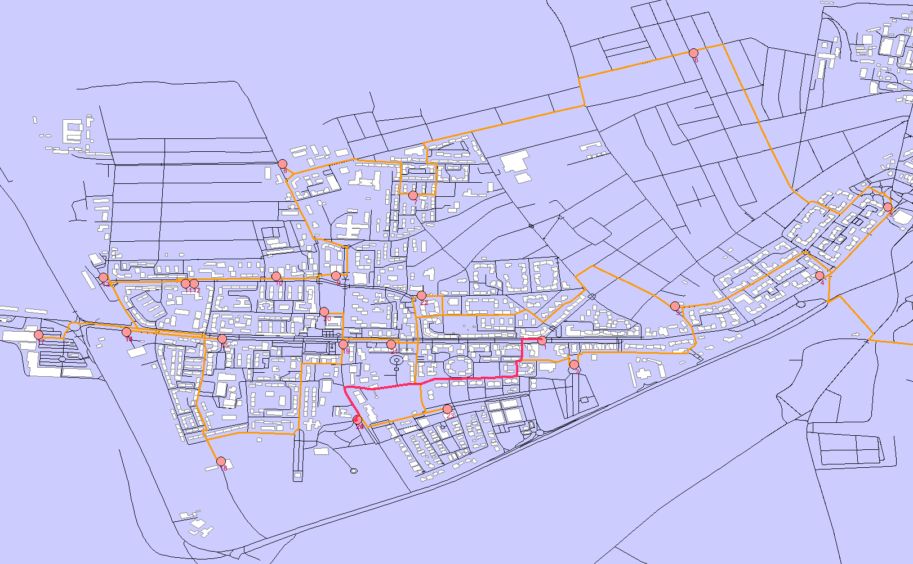
</p>
<p align="center">
  <em>One continuous ride through all 26 Slobozia Bike City stations and back, computed inside Oracle Spatial.</em>
</p>


This project is designed as part of my **Advanced Database Systems** course (SBDA) from my MSc curriculum. It uses **Oracle Spatial** with real geographic data from my hometown, Slobozia, Romania.

## **Table of Contents:**

1. [The Problem](#the-problem)
2. [The Idea](#the-idea)
3. [The Solution (Current Proof of Concept)](#the-solution-current-proof-of-concept)
4. [Technologies Used and Prerequisites](#technologies-used-and-prerequisites)
5. [Repository Structure](#repository-structure)
6. [Data Extraction Methodology](#data-extraction-methodology)
7. [The Staging Layer](#the-staging-layer)
8. [The Normalized Database and Oracle Spatial](#the-normalized-database-and-oracle-spatial)
9. [Map View: The City Layer by Layer](#map-view-the-city-layer-by-layer)
10. [Spatial Queries](#spatial-queries)
    - [Query #1: Total Length of the Street Network](#query-1-total-length-of-the-street-network)
    - [Query #2: Start and End Point of Every Street](#query-2-start-and-end-point-of-every-street)
    - [Query #3: The Nearest Stations to My Home](#query-3-the-nearest-stations-to-my-home)
    - [Query #4: The Minimum Network That Connects All Stations (PL/SQL)](#query-4-the-minimum-network-that-connects-all-stations-plsql)
    - [Query #5: Total Length of the Minimum Network](#query-5-total-length-of-the-minimum-network)
    - [Query #6: Walking the Network with CONNECT BY](#query-6-walking-the-network-with-connect-by)
    - [Query #7: One Continuous Chain Through All Stations (Recursive SQL)](#query-7-one-continuous-chain-through-all-stations-recursive-sql)
    - [Query #8: The Chain on One Line](#query-8-the-chain-on-one-line)
    - [Query #9: Street Route vs Straight Line for Every Leg](#query-9-street-route-vs-straight-line-for-every-leg)
    - [Query #10: Chain, Return Leg and Closed Loop Distance](#query-10-chain-return-leg-and-closed-loop-distance)
11. [A Known Limitation](#a-known-limitation)
12. [Export to GPX](#export-to-gpx)
13. [Future Directions](#future-directions)
14. [How to Run the Pipeline](#how-to-run-the-pipeline)
15. [Data Sources and Credits](#data-sources-and-credits)

---

## **The Problem**

Slobozia has a public bike-sharing system, **Slobozia Bike City**, run on the nextbike platform: 26 stations spread across the city. Yet there is no simple way to answer questions like:

- *Which stations are closest to where I live?*
- *What is the shortest set of street routes that connects every station?*
- *If I want to ride through every station in one go, which order should I take?*

Map apps give you a route from A to B. They do not plan a ride through a whole network of stations, and they know nothing about the bike-sharing system itself.

## **The Idea**

The original idea was bigger: a **custom route generator** for cyclists in Slobozia. Pick a starting station, and the system builds a ride by combining real street routes between stations.

To get there, the first step was to bring everything into one place where it can be queried spatially:

- the **city** itself (streets, buildings, points of interest) from OpenStreetMap
- the **bike stations** from the live nextbike feed
- the **real bike routes** between every pair of stations, computed by the BRouter routing engine
- the **bike lanes** that exist in the city

With all of that inside **Oracle Spatial**, route planning becomes a database problem: geometry, distances and graph algorithms, in SQL and PL/SQL.

## **The Solution (Current Proof of Concept)**

The current state of the repository is a working end-to-end pipeline, from public APIs to a rideable GPX file:

1. It finds the **stations nearest to my home**. The closest one is **Casa Armatei, 120.91 m away**.
2. It computes the **minimum network that connects all 26 stations** (a minimum spanning tree, written in PL/SQL).
3. Starting from my nearest station, it builds **one continuous chain that visits every station exactly once** and returns to the start (recursive SQL).
4. It exports that loop as a **GPX file** that can be loaded on a phone or a bike computer.

The headline numbers:

| What | Count | Length |
| --- | --- | --- |
| Streets in the city | 1,156 | 237.584 km |
| Bike routes between every pair of stations | 323 | 523.295 km |
| **Minimum network (MST)** that connects all stations | 25 routes | **12.601 km** |
| **Chain** through all stations | 25 legs | **21.362 km** |
| Return leg to the start station | 1 leg | 1.037 km |
| **Closed loop** | 26 legs | **22.399 km** |

In one sentence: *the MST is the cheapest bike-lane **network** the city could build (12.6 km), and the chain is the best single **ride** through all stations for a cyclist (22.4 km as a loop).*

## **Technologies Used and Prerequisites**

- **Database engine**: Oracle Database 21c Enterprise Edition, with **Oracle Spatial** (`SDO_GEOMETRY`, spatial indexes, `SDO_GEOM`, `SDO_UTIL`, `SDO_CS`) and the native `JSON` data type
- **Python 3.13** for extraction and loading: `requests`, `oracledb` (thin mode), `python-dotenv`
- **Tools**: Oracle SQL Developer (worksheets, **Map View** for spatial layers, **Data Modeler** for the diagrams) and Visual Studio Code with the Oracle SQL Developer extension
- **Prerequisites**:
  - an Oracle user with `CREATE TABLE`, `CREATE TYPE`, `CREATE INDEXTYPE` and tablespace quota
  - a `.env` file at the repository root with `ORACLE_USER`, `ORACLE_PASSWORD` and `ORACLE_DSN` (it is git-ignored)
  - on Windows, run the Python scripts with `python -X utf8` so Romanian letters print correctly

## **Repository Structure**

```
SLB_Slobozia_Byke_Routes/
├── screenshots/                     every step, numbered in story order
│   ├── 01_staging/
│   ├── 02_slb_schema/
│   ├── 03_spatial_setup/
│   ├── 04_map_view/
│   └── 05_spatial_queries/
└── src/
    ├── data_sample/                 raw files from the APIs + the exported GPX
    ├── scripts/
    │   ├── data_extraction/         one folder per source: extractor + loader
    │   └── data_export/             GPX export
    ├── ddl_commands/
    │   ├── staging/                 STG_ tables + validation queries
    │   ├── db/                      SLB_ tables (create + insert)
    │   └── db_spatial_related_commands/   metadata + spatial indexes
    └── queries/                     MST, chain, nearest stations, Map View layers
```

---

## **Data Extraction Methodology**

Every source follows the same pattern: an **extractor** downloads the data and saves it as a file in [`src/data_sample/`](src/data_sample/), then a **loader** inserts that file, unchanged, into a staging table. Keeping the raw file means the database can always be rebuilt without calling the APIs again.

### **Source #1: The City Map (OpenStreetMap)**

The official OSM API returns every node, way and relation inside a bounding box. Slobozia's administrative boundary is a long strip that reaches far north, so I used a manual bounding box around the city instead:

```python
MAP_URL = "https://api.openstreetmap.org/api/0.6/map.json"

# west, south, east, north
CITY_BBOX = "27.305918,44.532187,27.409430,44.587655"
```

The script first requests a small test box, then the whole city. The result is one 5.8 MB JSON file with **24,660 nodes, 2,978 ways and 67 relations**.

- Source code: [extractor](src/scripts/data_extraction/slobozia_map_extraction/slobozia_map_extractor.py), [loader](src/scripts/data_extraction/slobozia_map_extraction/slobozia_map_loader.py)

### **Source #2: The Bike Stations (nextbike live feed)**

nextbike publishes a live JSON feed for every city it operates in. Slobozia is city `978`. The feed also contains loose bikes parked outside stations, so only places marked as stations (`spot = true`) are kept:

```python
NEXTBIKE_URL = "https://maps2.nextbike.net/maps/nextbike-live.json"
SLOBOZIA_CITY_ID = 978

places = data["countries"][0]["cities"][0]["places"]
stations = [p for p in places if p["spot"]]
```

Result: **26 stations** (26 unique ids, 24 unique locations: two pairs of stations share the exact same spot).

- Source code: [extractor](src/scripts/data_extraction/byke_stations_extraction/byke_stations_extractor.py), [loader](src/scripts/data_extraction/byke_stations_extraction/byke_stations_loader.py)

### **Source #3: Bike Routes Between Every Pair of Stations (BRouter)**

[BRouter](https://brouter.de/) is an open-source routing engine built for bicycles, running on OpenStreetMap data. For each of the **26 × 25 / 2 = 325 station pairs**, the script asks BRouter for the best route with the `trekking` profile and saves the GeoJSON answer:

```python
params = {
    "lonlats": f"{from_station['lng']},{from_station['lat']}|{to_station['lng']},{to_station['lat']}",
    "profile": "trekking",
    "alternativeidx": 0,
    "format": "geojson",
}
```

The script pauses 2 seconds between requests to be gentle with the public server, and skips pairs that are already saved, so it can be resumed after a failure. Each pair is stored once, with the smaller station uid first. Together the 325 routes add up to **523.295 km**.

- Source code: [extractor](src/scripts/data_extraction/byke_routes_extraction/byke_route_ideal_extractor.py), [loader](src/scripts/data_extraction/byke_routes_extraction/byke_route_ideal_loader.py)

### **Source #4: The Bike Lanes (traced by hand + BRouter)**

A check of the OSM data showed that **Slobozia has no mapped bike lanes**: no `highway=cycleway`, and the `cycleway` tags are only `no` or empty. So I traced the lanes I know from riding in the city myself, as lists of waypoints, and let BRouter snap them onto the streets:

```python
{
    "track_code": "unirii",
    "track_name": "Bulevardul Unirii (Strada Gării → Bulevardul Chimiei)",
    "waypoints": "27.350979,44.564648;27.3609807,44.5645017",
},
```

The lanes are split at junctions, and the segments that meet share the exact coordinates of an OSM junction node, so they touch perfectly. Result: **7 segments, 5,148 m** of bike lanes.

- Source code: [extractor](src/scripts/data_extraction/byke_tracks_extraction/byke_tracks_extractor.py), [loader](src/scripts/data_extraction/byke_tracks_extraction/byke_tracks_loader.py)

---

## **The Staging Layer**

Between the raw sources and the normalized database sits a **staging layer**: intermediate tables that hold the data exactly as received. Their job is to keep the source untouched, so every transformation happens later, in SQL, and can be repeated or corrected at any time.

Staging tables deliberately have **no primary or foreign keys**, and the API answers are stored whole in native `JSON` columns:

```sql
create table stg_osm_map (
   load_date  timestamp default systimestamp not null,
   bbox_north number(10,7) not null,
   bbox_west  number(10,7) not null,
   bbox_south number(10,7) not null,
   bbox_east  number(10,7) not null,
   payload    json not null
);

create table stg_ideal_routes_between_byke_stations (
   from_station_uid number not null,
   to_station_uid   number not null,
   route_profile    varchar2(30) not null,
   payload          json not null,
   load_date        timestamp default systimestamp not null
);
```

| Staging table | Rows | Content |
| --- | --- | --- |
| `STG_OSM_MAP` | 1 | the whole city as one JSON document |
| `STG_BYKES_STATIONS_COORDINATES` | 26 | one row per station |
| `STG_IDEAL_ROUTES_BETWEEN_BYKE_STATIONS` | 325 | one BRouter GeoJSON per station pair |
| `STG_BYKE_TRACKS` | 7 | one BRouter GeoJSON per bike lane segment |

**A loading problem worth noting:** inserting the 5.8 MB map with the `DB_TYPE_JSON` bind type made the Python driver hang while encoding the document on the client. Binding the payload as plain text and letting Oracle convert it on the server solved it:

```python
cursor.setinputsizes(payload=oracledb.DB_TYPE_CLOB)
```

- Source code: [staging DDL and validation queries](src/ddl_commands/staging/)

<details>
  <summary>Staging diagram:</summary>
  <br>
  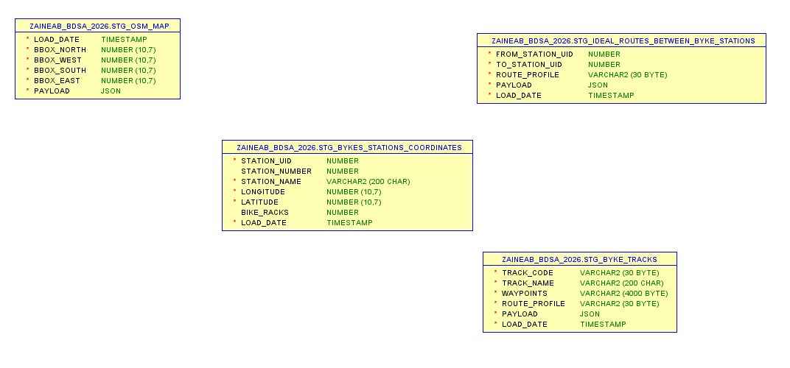
</details>

---

## **The Normalized Database and Oracle Spatial**

The final tables use the `SLB_` prefix. Each one is built **from staging with SQL**, gets proper keys, and stores its shape in an `SDO_GEOMETRY` column with **SRID 8307** (WGS 84 longitude/latitude), so Oracle measures distances in real meters on the Earth's surface.

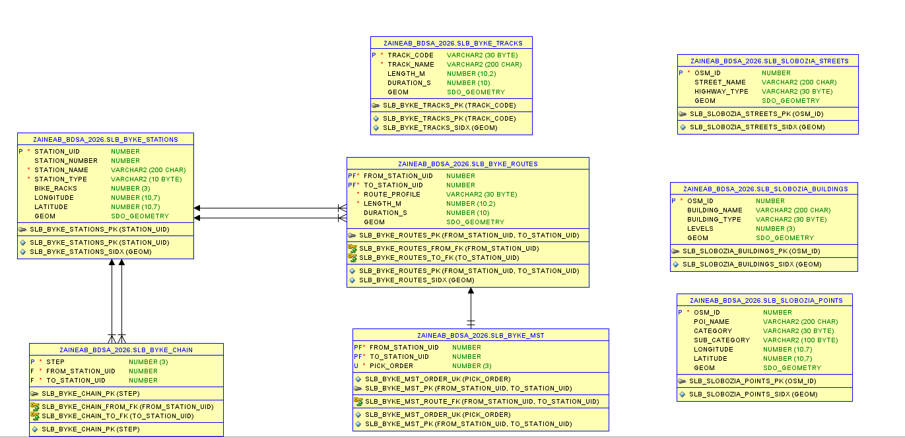

The schema has two groups:

- **The bike network**, linked by keys: `SLB_BYKE_ROUTES` references `SLB_BYKE_STATIONS` twice (from and to); `SLB_BYKE_MST` references `SLB_BYKE_ROUTES` with a composite foreign key; `SLB_BYKE_CHAIN` references `SLB_BYKE_STATIONS` twice.
- **The city layers** (`SLB_SLOBOZIA_POINTS`, `SLB_SLOBOZIA_STREETS`, `SLB_SLOBOZIA_BUILDINGS`) and the bike lanes (`SLB_BYKE_TRACKS`), which have no foreign keys. They relate to the network **spatially**, through their geometry and spatial queries, not through keys.

| Table | Geometry | Rows | Built from |
| --- | --- | --- | --- |
| `SLB_SLOBOZIA_POINTS` | point (2001) | 272 | OSM nodes with amenity, shop, leisure, tourism, healthcare, office, historic or transport tags |
| `SLB_SLOBOZIA_STREETS` | line (2002) | 1,156 | OSM ways with a `highway` tag |
| `SLB_SLOBOZIA_BUILDINGS` | polygon (2003) | 1,517 | closed OSM ways with a `building` tag |
| `SLB_BYKE_STATIONS` | point (2001) | 26 | nextbike staging |
| `SLB_BYKE_ROUTES` | line (2002) | 323 | BRouter staging |
| `SLB_BYKE_TRACKS` | line (2002) | 7 | bike lane staging |
| `SLB_BYKE_MST` | none (keys only) | 25 | Query #4 |
| `SLB_BYKE_CHAIN` | none (keys only) | 26 | Query #7 |

### **From JSON to geometry: three techniques**

**1. Points built directly from coordinates.** A station or a POI is a single point, so its geometry is assembled from longitude and latitude:

```sql
mdsys.sdo_geometry(
   2001,
   8307,
   mdsys.sdo_point_type(stg.longitude, stg.latitude, null),
   null,
   null
)
```

**2. Streets and buildings built as WKT text.** An OSM way only stores the **ids** of its nodes, not their coordinates. So the insert unnests the node list with `json_table` (keeping the order with `for ordinality`), joins every node id to its coordinates, glues the points into a `LINESTRING (...)` or `POLYGON ((...))` text with `LISTAGG`, and lets Oracle turn that text into a geometry:

```sql
'LINESTRING ('
|| listagg(sp.node_lon || ' ' || sp.node_lat, ', ')
      within group (order by sp.node_seq)
|| ')' as nodes_formated
...
mdsys.sdo_geometry(sw.nodes_formated, 8307) as geom
```

To make the join fast, the 24,660 node coordinates are first copied into a helper table, `SLB_SLOBOZIA_STREETS_NODES_LOOKUP`, with the node id as primary key.

For buildings, **749 polygons were drawn clockwise** in OSM, while Oracle expects outer rings counter-clockwise (error ORA-13367). `SDO_UTIL.RECTIFY_GEOMETRY` fixed all of them:

```sql
sdo_util.rectify_geometry(mdsys.sdo_geometry(bw.wkt, 8307), 0.05)
```

**3. Routes and lanes converted from GeoJSON.** BRouter already answers in GeoJSON, so the geometry is taken straight from the payload. BRouter also adds the elevation as a third coordinate, which `SDO_CS.MAKE_2D` removes:

```sql
sdo_cs.make_2d(
   sdo_util.from_geojson(
      json_query(stg.payload, '$.features[0].geometry' returning clob)
   ),
   8307
) as geom
```

Two of the 325 routes have a length of 0, because their stations sit on the exact same spot. A route with zero length is not a valid line, so they were filtered out, leaving **323 routes**.

- Source code: [city tables](src/ddl_commands/db/slobozia_map/), [bike tables](src/ddl_commands/db/byke_related/), [MST and chain tables](src/ddl_commands/db/query_related/)

### **Spatial metadata and indexes**

Every spatial table is registered in `USER_SDO_GEOM_METADATA` (the coordinate bounds, the tolerance of 0.05 and the SRID) and gets an R-tree spatial index:

```sql
insert into user_sdo_geom_metadata (table_name, column_name, diminfo, srid)
values (
   'SLB_BYKE_STATIONS',
   'GEOM',
   mdsys.sdo_dim_array(
      mdsys.sdo_dim_element('X', -180, 180, 0.05),
      mdsys.sdo_dim_element('Y', -90, 90, 0.05)
   ),
   8307
);

create index slb_byke_stations_sidx on slb_byke_stations (geom)
   indextype is mdsys.spatial_index_v2;
```

- Source code: [metadata](src/ddl_commands/db_spatial_related_commands/metadata/), [indexes](src/ddl_commands/db_spatial_related_commands/index/)

<details>
  <summary>Metadata and index check:</summary>
  <br>
  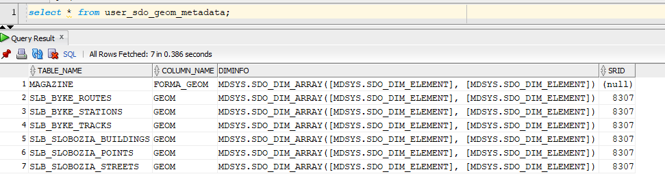
  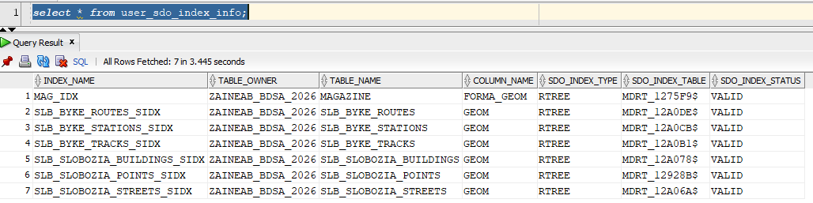
</details>

---

## **Map View: The City Layer by Layer**

SQL Developer's **Map View** draws the result of any query that returns a geometry. Two rules learned along the way: the query must **not end with `;`**, because Map View wraps it in its own SQL, and it must read from **a single table**, because Map View adds a `ROWID` to every row (ORA-01445 otherwise). When a layer needs data from another table, it comes through a scalar subquery.

All layer queries: [`src/queries/map_view_layers/`](src/queries/map_view_layers/)

**For reference**, the real area on Google Maps:

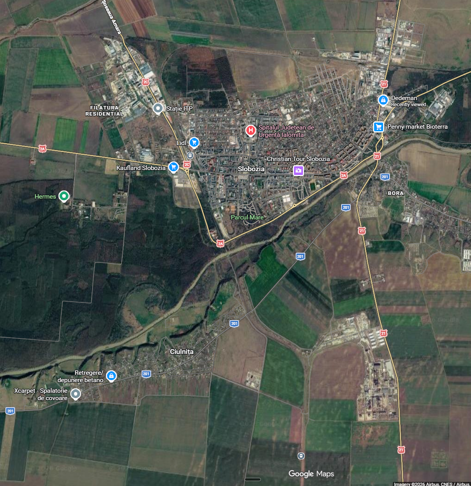

*Source: Google Maps, imagery © 2026 Airbus, CNES / Airbus. Used only as a visual reference; all project data comes from OpenStreetMap, nextbike and BRouter.*

<details>
  <summary>Layer 1: points of interest</summary>
  <br>

```sql
select osm_id, poi_name, category, geom
  from slb_slobozia_points
```

  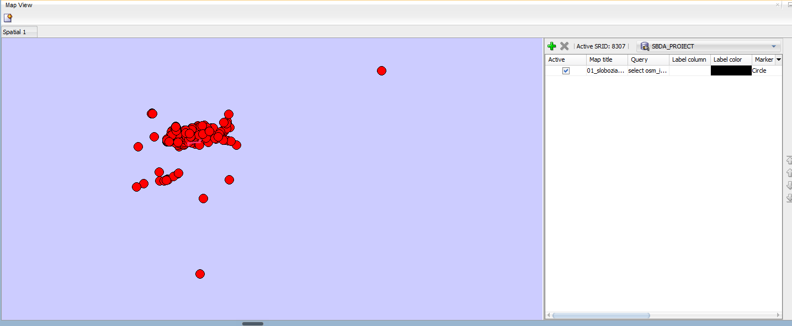
</details>

<details>
  <summary>Layer 2: streets under the points</summary>
  <br>

```sql
select osm_id, street_name, highway_type, geom
  from slb_slobozia_streets
```

  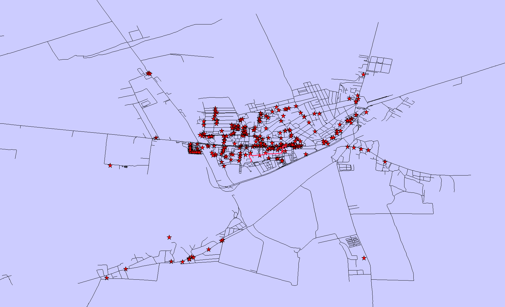
</details>

<details>
  <summary>Layer 3: buildings, the full city</summary>
  <br>

```sql
select osm_id, building_name, building_type, geom
  from slb_slobozia_buildings
```

  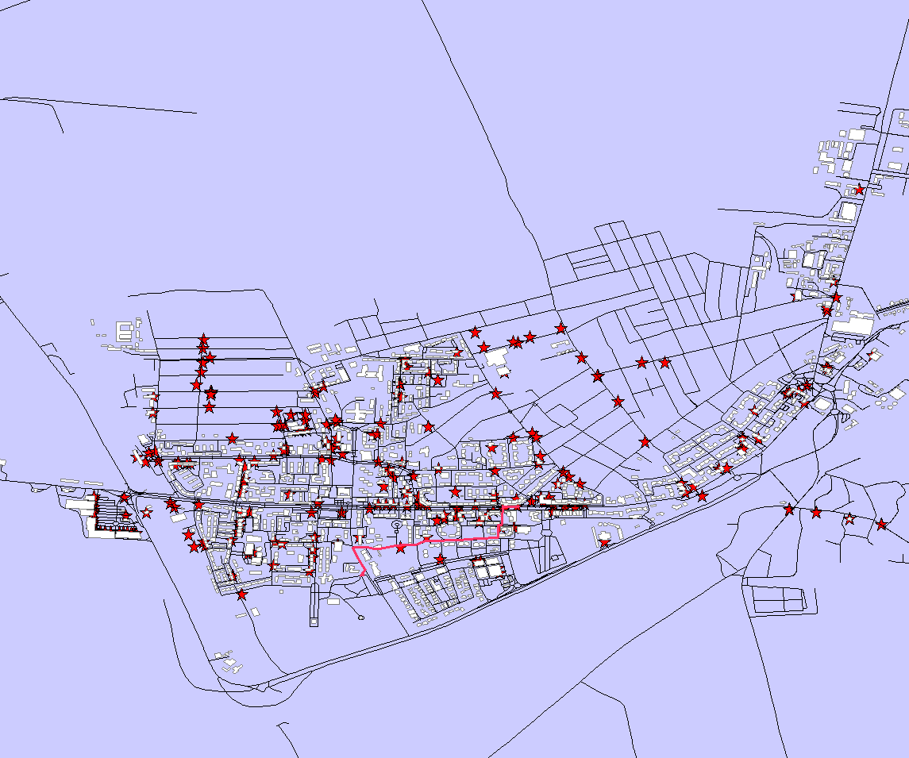
</details>

<details>
  <summary>Layer 4: bike lanes and stations</summary>
  <br>

```sql
select track_code, track_name, geom
  from slb_byke_tracks
```

```sql
select station_uid, station_name, station_type, geom
  from slb_byke_stations
```

  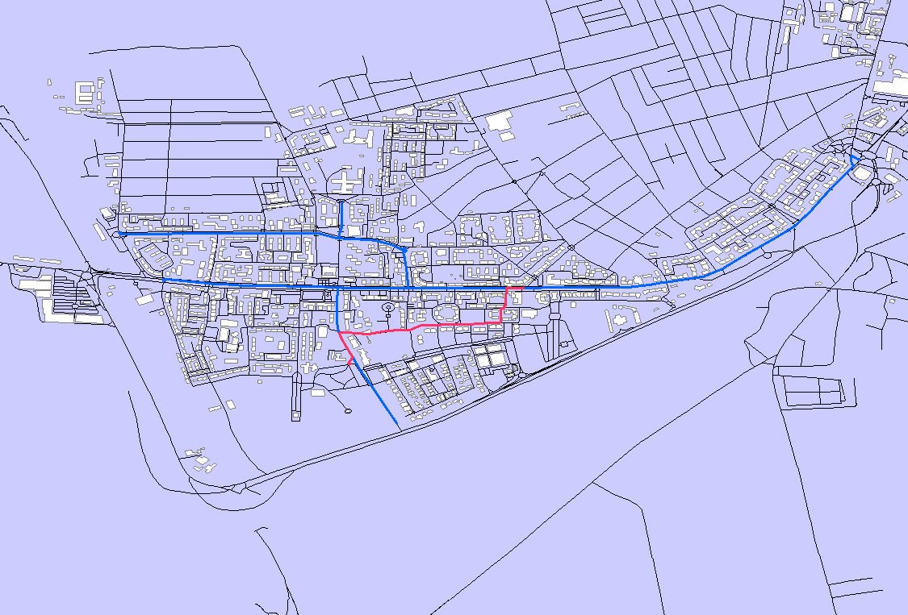
  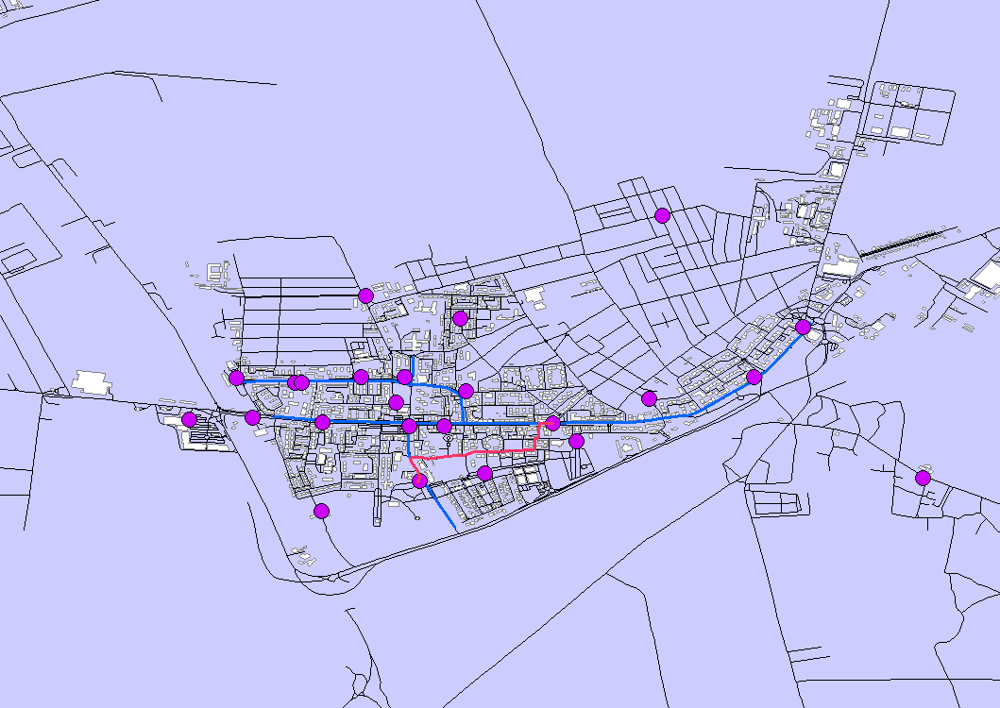
</details>

<details>
  <summary>Layer 5: all 323 routes between stations</summary>
  <br>

```sql
select from_station_uid, to_station_uid, length_m, geom
  from slb_byke_routes
```

  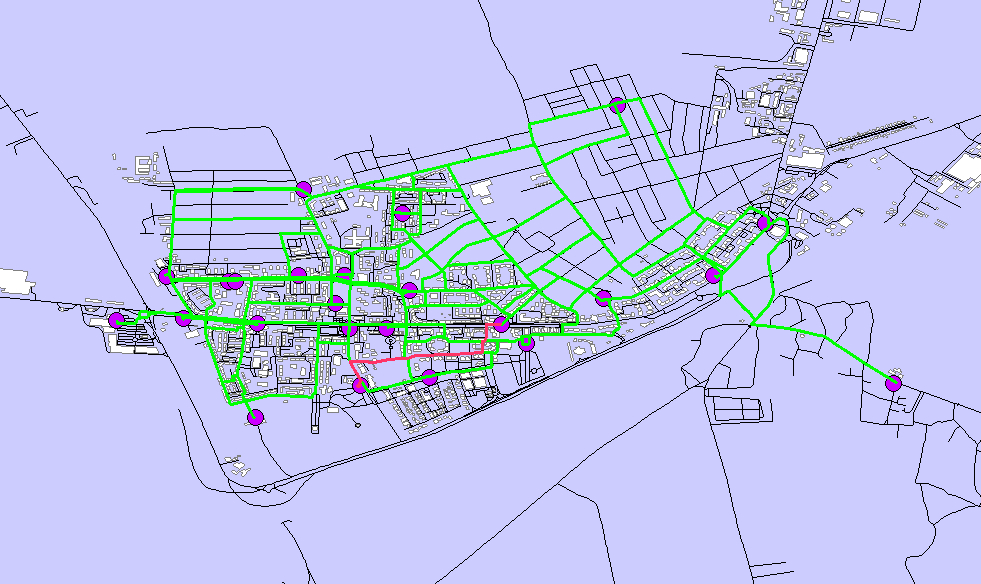
</details>

<details>
  <summary>Layer 6: the minimum network (MST)</summary>
  <br>

A multi-column `IN` keeps the query on a single table:

```sql
select r.from_station_uid, r.to_station_uid, r.length_m, r.geom
  from slb_byke_routes r
 where ( r.from_station_uid, r.to_station_uid ) in (
          select from_station_uid, to_station_uid
            from slb_byke_mst
       )
```

  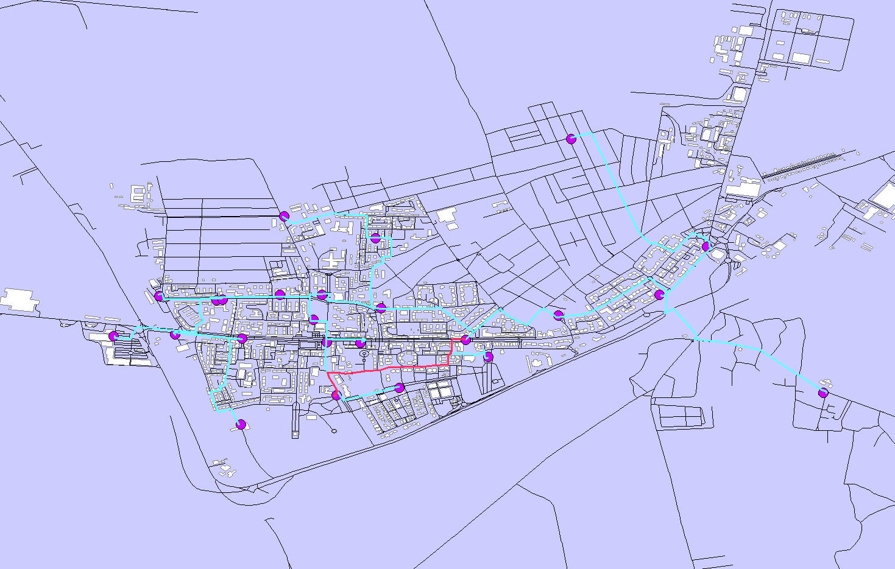
</details>

<details>
  <summary>Layer 7: the open chain, with stations numbered in visit order</summary>
  <br>

The chain stores every leg in **riding direction**, but routes are stored with the smaller uid first. When a leg is ridden backwards, `SDO_UTIL.REVERSE_LINESTRING` flips the line so it starts where the ride starts:

```sql
select ch.step,
       ( select case when ch.from_station_uid < ch.to_station_uid
                     then r.geom
                     else sdo_util.reverse_linestring(r.geom) end
           from slb_byke_routes r
          where r.from_station_uid = least(ch.from_station_uid, ch.to_station_uid)
            and r.to_station_uid   = greatest(ch.from_station_uid, ch.to_station_uid)
       ) as geom
  from slb_byke_chain ch
 where ch.step < ( select max(step) from slb_byke_chain )
```

Every station is the start of exactly one leg, so its visit order is the step where it is the `from` station:

```sql
select s.station_uid,
       ( select ch.step
           from slb_byke_chain ch
          where ch.from_station_uid = s.station_uid ) as visit_order,
       s.geom
  from slb_byke_stations s
```

  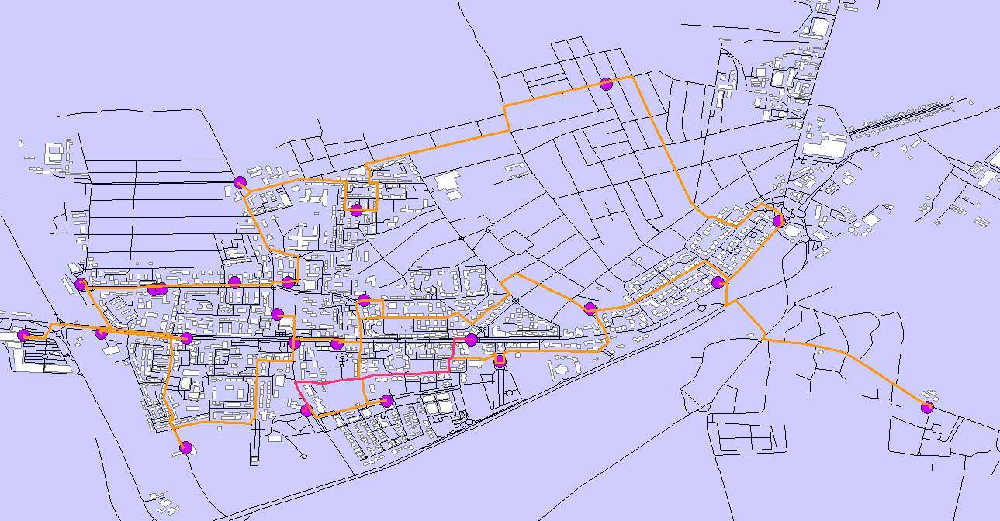
  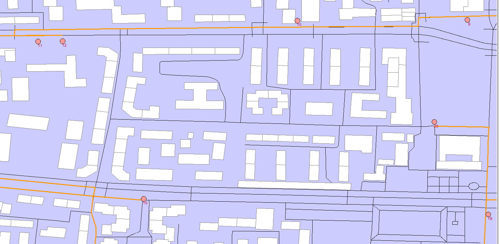
</details>

<details>
  <summary>Layer 8: the closed loop (chain + return leg)</summary>
  <br>

Same query as the chain, with `where ch.step = ( select max(step) from slb_byke_chain )` to draw only the return leg in its own color. Source: [08_closed_loop_return_leg.sql](src/queries/map_view_layers/08_closed_loop_return_leg.sql)

  
</details>

---

## **Spatial Queries**

> **Note:** every query below can be run as it is in a SQL Developer worksheet. Where a query is saved in the repository, the link to its file is given under it.

### **Query #1: Total Length of the Street Network**

`SDO_GEOM.SDO_LENGTH` measures a line along its whole shape. Because the SRID is geodetic (8307), the result is in real kilometers, not degrees.

```sql
select count(*) as nr_streets,
       round(sum(sdo_geom.sdo_length(geom, 0.05, 'unit=KM')), 3) as total_km
  from slb_slobozia_streets;
```

Result: **1,156 streets, 237.584 km**. This counts every mapped way (roads, but also footways, service roads and tracks).

<details>
  <summary>Result:</summary>
  <br>
  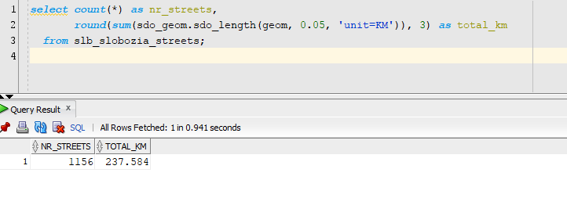
</details>

---

### **Query #2: Start and End Point of Every Street**

A line is a list of vertices. `SDO_UTIL.GETNUMVERTICES` tells how many there are, and `SDO_UTIL.GET_COORDINATE` returns any of them as a point: vertex 1 is the start, the last vertex is the end. The point's longitude and latitude are then read with dot notation (`.sdo_point.x` / `.y`), which in Oracle requires a table alias.

```sql
select s.osm_id,
       s.street_name,
       s.start_point.sdo_point.x as start_lon,
       s.start_point.sdo_point.y as start_lat,
       s.end_point.sdo_point.x   as end_lon,
       s.end_point.sdo_point.y   as end_lat,
       s.length_m
  from ( select osm_id,
                street_name,
                sdo_util.get_coordinate(geom, 1) as start_point,
                sdo_util.get_coordinate(geom, sdo_util.getnumvertices(geom)) as end_point,
                round(sdo_geom.sdo_length(geom, 0.05, 'unit=M'), 2) as length_m
           from slb_slobozia_streets ) s
 fetch first 10 rows only;
```

<details>
  <summary>Result:</summary>
  <br>
  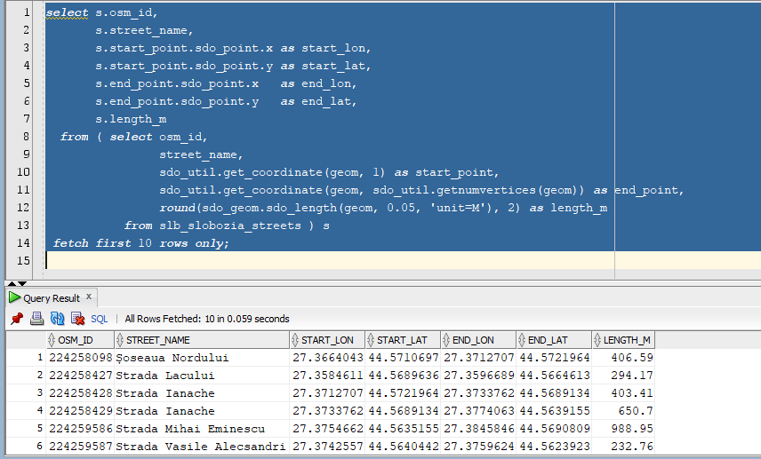
</details>

---

### **Query #3: The Nearest Stations to My Home**

This is where the story becomes personal. `SDO_GEOM.SDO_DISTANCE` measures the distance between my home building (a polygon) and every station (a point). For a polygon, the distance is taken from its closest wall, which is the realistic walking distance.

```sql
select s.station_uid,
       s.station_name,
       round(sdo_geom.sdo_distance(b.geom, s.geom, 0.05, 'unit=M'), 2) as distance_m
  from slb_slobozia_buildings b
 cross join slb_byke_stations s
 where b.osm_id = 254133133
 order by distance_m
 fetch first 5 rows only;
```

Result: the nearest station is **Casa Armatei, 120.91 m away**. That is why every route below starts there.

- Source code: [top_5_closest_station_to_certain_building.sql](src/queries/closest_station_to_certain_building/top_5_closest_station_to_certain_building.sql)

<details>
  <summary>Result:</summary>
  <br>
  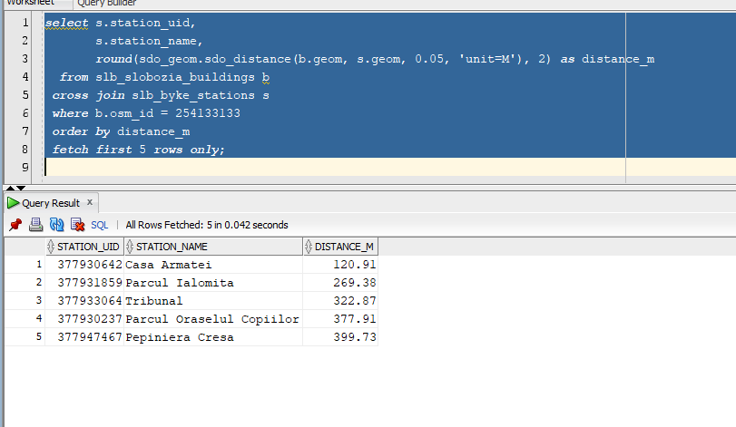
</details>

---

### **Query #4: The Minimum Network That Connects All Stations (PL/SQL)**

> **Task description:**
> Out of the 323 real routes, choose the ones that connect **all 26 stations** (so you can ride from any station to any other) with the **minimum total length**.

The answer is always **25 routes** (stations minus one): fewer would leave a station out, more would create a loop, and a loop is wasted kilometers. This is a **minimum spanning tree**, and the block uses **Kruskal's algorithm**:

1. Every station starts alone, in its own group.
2. Walk through the routes from the **shortest to the longest**.
3. If a route joins two stations from **different groups**, keep it and merge the two groups into one.
4. If both stations are already in the **same group**, skip it, because they are already connected and the route would close a loop.

The groups live in a PL/SQL **associative array**, indexed by `station_uid`. When two groups merge, every station of the second group is relabeled with the first group's label:

```sql
declare
   type t_group_map is table of number index by pls_integer;
   v_group      t_group_map;
   v_from_group number;
   v_to_group   number;
   v_uid        pls_integer;
   v_kept       pls_integer := 0;
begin
   for st in ( select station_uid from slb_byke_stations ) loop
      v_group(st.station_uid) := st.station_uid;
   end loop;

   for rt in ( select from_station_uid, to_station_uid, length_m
                 from slb_byke_routes
                order by length_m ) loop
      v_from_group := v_group(rt.from_station_uid);
      v_to_group   := v_group(rt.to_station_uid);

      if v_from_group <> v_to_group then
         v_kept := v_kept + 1;
         insert into slb_byke_mst ( from_station_uid, to_station_uid, pick_order )
         values ( rt.from_station_uid, rt.to_station_uid, v_kept );

         v_uid := v_group.first;
         while v_uid is not null loop
            if v_group(v_uid) = v_to_group then
               v_group(v_uid) := v_from_group;
            end if;
            v_uid := v_group.next(v_uid);
         end loop;
      end if;
   end loop;
   commit;
end;
/
```

<details>
  <summary>How the group array evolves (example with 5 stations):</summary>
  <br>

Routes sorted by length: A-B 100 m, C-D 150 m, B-D 200 m, A-C 250 m, C-E 300 m.

| station | start | after A-B | after C-D | after B-D | after A-C | after C-E |
| --- | --- | --- | --- | --- | --- | --- |
| A | A | A | A | A | A | A |
| B | B | **A** | A | A | A | A |
| C | C | C | C | **A** | A | A |
| D | D | D | **C** | **A** | A | A |
| E | E | E | E | E | E | **A** |
| decision | | KEEP | KEEP | KEEP | **SKIP** | KEEP |

The key step is **B-D**: the groups are A (B's group) and C (D's group), so **both C and D** move to group A. That is exactly why the next route, A-C, is correctly skipped: A and C are already connected through B and D.

</details>

<details>
  <summary>Output excerpt from the real data:</summary>
  <br>

```
Stations loaded: 26
KEEP 377935443-377979468 (29 m)
KEEP 377936278-377946572 (214 m)
KEEP 377933310-377935123 (217 m)
KEEP 377930237-377936278 (256 m)
KEEP 377933310-377946572 (256 m)
KEEP 377921586-377935443 (316 m)
SKIP 377921586-377979468 (346 m)
...
KEEP 377932730-636027002 (1368 m)
Routes kept: 25
```

</details>

- Source code: [slb_byke_mst_insert.sql](src/queries/route_that_connects_all_stations/slb_byke_mst_insert.sql), table: [slb_byke_mst_table_creation.sql](src/ddl_commands/db/query_related/slb_byke_mst_table_creation.sql)

---

### **Query #5: Total Length of the Minimum Network**

The total is computed twice: from BRouter's own `length_m`, and measured again by Oracle with `SDO_LENGTH`. The two agree, which confirms the source data.

```sql
select count(*) as nr_routes,
       round(sum(r.length_m) / 1000, 3) as mst_km,
       round(sum(sdo_geom.sdo_length(r.geom, 0.05, 'unit=M')) / 1000, 3) as mst_km_spatial,
       max(a.all_routes_km) as all_routes_km
  from slb_byke_mst m
  join slb_byke_routes r
    on r.from_station_uid = m.from_station_uid
   and r.to_station_uid   = m.to_station_uid
 cross join ( select round(sum(length_m) / 1000, 3) as all_routes_km
                from slb_byke_routes ) a;
```

Result: **25 routes, 12.601 km** (Oracle measures 12.596 km), against **523.295 km** for all routes. The minimum network connects every station with about **2.4%** of the total route length.

- Source code: [slb_byke_mst_total_length.sql](src/ddl_commands/db/query_related/slb_byke_mst_total_length.sql)

<details>
  <summary>Result:</summary>
  <br>
  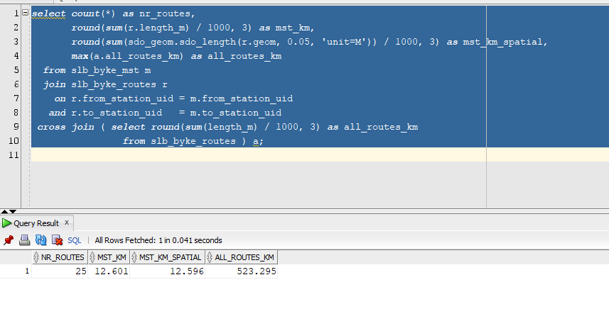
</details>

---

### **Query #6: Walking the Network with CONNECT BY**

The MST is a **tree**, not a line: some stations are crossroads with several branches. Casa Armatei alone has three. A hierarchical query shows every branch as a path, starting from my station.

Routes are stored in one direction only, so the first step lists each route **both ways**. `CONNECT BY PRIOR` then follows the rule "the next route starts where the previous one ended", and `prior station_a <> station_b` stops the walk from turning back (otherwise Oracle raises ORA-01436, a loop). `SYS_CONNECT_BY_PATH` builds the path as text, and `CONNECT_BY_ISLEAF = 1` keeps only the complete branches.

```sql
with mst_edges as (
   select from_station_uid as station_a, to_station_uid as station_b from slb_byke_mst
   union all
   select to_station_uid, from_station_uid from slb_byke_mst
),
named_edges as (
   select e.station_a, e.station_b, s.station_name as name_b
     from mst_edges e
     join slb_byke_stations s on s.station_uid = e.station_b
)
select level as nr_routes,
       ( select station_name from slb_byke_stations where station_uid = 377930642 )
       || sys_connect_by_path(name_b, ' -> ') as path
  from named_edges
 where connect_by_isleaf = 1
 start with station_a = 377930642
connect by prior station_b = station_a
       and prior station_a <> station_b;
```

<details>
  <summary>Result:</summary>
  <br>
  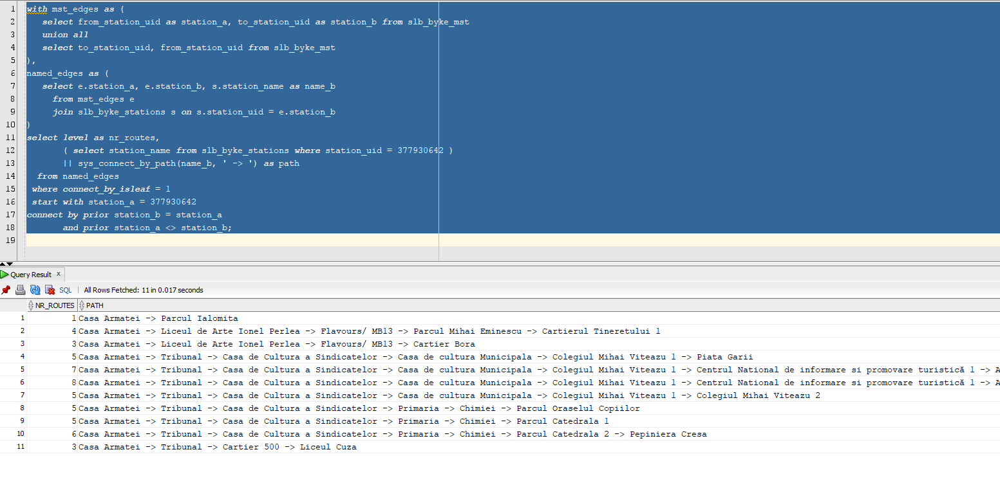
</details>

---

### **Query #7: One Continuous Chain Through All Stations (Recursive SQL)**

> **Task description:**
> Starting from my nearest station, ride to every station **exactly once**, in one continuous line, and then return to the start.

The method is the **nearest-neighbour** rule: from where you are, always ride to the closest station you have not visited yet. Since there is a route between every pair of stations, there are no dead ends.

It is written as a **recursive `WITH`**, a query that calls itself round after round:

- The **anchor** is round 0: we stand at Casa Armatei.
- Each new round reads **only the rows of the previous round**, looks at every route leaving the current station, and ranks the candidates by length with `ROW_NUMBER`. Only the nearest one (`rn = 1`) continues to the next round.
- The `visited` column is the memory: a text list like `/A/B/C/`, copied from round to round with the new station added. `INSTR(visited, '/' || station || '/') = 0` means "not visited yet". The slashes stop uid `12` from matching inside `123`.
- When no unvisited station is left, a round returns no rows and the recursion stops.

```sql
insert into slb_byke_chain ( step, from_station_uid, to_station_uid )
with routes_2way as (
   select from_station_uid as station_a, to_station_uid as station_b, length_m
     from slb_byke_routes
   union all
   select to_station_uid, from_station_uid, length_m
     from slb_byke_routes
),
chain ( step, from_uid, station_uid, visited, rn ) as (
   select 0,
          cast(null as number),
          station_uid,
          cast('/' || station_uid || '/' as varchar2(4000)),
          1
     from slb_byke_stations
    where station_uid = 377930642
   union all
   select c.step + 1,
          c.station_uid,
          r.station_b,
          c.visited || r.station_b || '/',
          row_number() over ( partition by c.step order by r.length_m, r.station_b )
     from chain c
     join routes_2way r
       on r.station_a = c.station_uid
    where c.rn = 1
      and instr(c.visited, '/' || r.station_b || '/') = 0
)
select step, from_uid, station_uid
  from chain
 where rn = 1
   and step > 0;
```

A second insert closes the loop, from the last station back to the first:

```sql
insert into slb_byke_chain ( step, from_station_uid, to_station_uid )
select l.step + 1, l.to_station_uid, f.from_station_uid
  from slb_byke_chain l
  join slb_byke_chain f on f.step = 1
 where l.step = ( select max(step) from slb_byke_chain );
```

<details>
  <summary>How the rounds work (example with 4 stations, start at A):</summary>
  <br>

Routes: A-B 100, B-C 150, C-D 200, A-C 300, B-D 400, A-D 500 (meters).

| round | continues from | candidates left after `INSTR` | rows produced (step, from, to, visited, rn) |
| --- | --- | --- | --- |
| 0 | (anchor) | | **0, NULL, A, `/A/`, 1** |
| 1 | A | B 100, C 300, D 500 | **1, A, B, `/A/B/`, 1** · 1, A, C, `/A/C/`, 2 · 1, A, D, `/A/D/`, 3 |
| 2 | B | ~~A~~, C 150, D 400 | **2, B, C, `/A/B/C/`, 1** · 2, B, D, `/A/B/D/`, 2 |
| 3 | C | ~~A~~, ~~B~~, D 200 | **3, C, D, `/A/B/C/D/`, 1** |
| 4 | D | none | no rows, so the recursion stops |

The final `where rn = 1 and step > 0` keeps only the winners: **A → B → C → D**.

</details>

To see the `visited` memory grow on the real data, run the same `WITH` and end it with `select step, from_uid, station_uid, visited from chain where rn = 1 order by step`:

<details>
  <summary>Result:</summary>
  <br>
  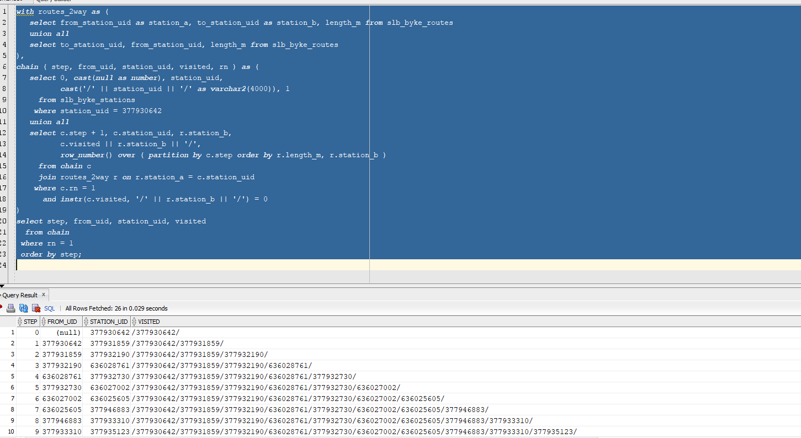
</details>

- Source code: [slb_byke_chain_insert.sql](src/queries/route_that_connects_all_stations/slb_byke_chain_insert.sql), table: [slb_byke_chain.sql](src/ddl_commands/db/query_related/slb_byke_chain.sql)

---

### **Query #8: The Chain on One Line**

Every station starts exactly one leg, so gluing the `from` station names in step order with `LISTAGG` gives the whole ride. The start station is added once more at the end to close the loop.

```sql
select listagg(s.station_name, ' -> ') within group ( order by ch.step )
       || ' -> '
       || max(case when ch.step = 1 then s.station_name end) as loop_path
  from slb_byke_chain ch
  join slb_byke_stations s on s.station_uid = ch.from_station_uid;
```

- Source code: [slb_byke_chain_name_showcase.sql](src/ddl_commands/db/query_related/slb_byke_chain_name_showcase.sql)

<details>
  <summary>Result:</summary>
  <br>
  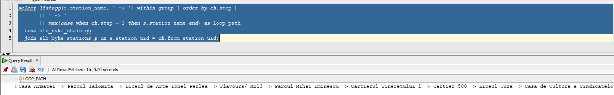
</details>

---

### **Query #9: Street Route vs Straight Line for Every Leg**

For each leg of the chain, the real distance along the streets (from BRouter) is compared with the straight-line distance (`SDO_DISTANCE`). The street route is always longer; the gap shows how much the street layout forces a detour.

```sql
select ch.step,
       sf.station_name as from_station,
       st.station_name as to_station,
       r.length_m as route_m,
       round(sdo_geom.sdo_distance(sf.geom, st.geom, 0.05, 'unit=M'), 2) as straight_line_m
  from slb_byke_chain ch
  join slb_byke_stations sf on sf.station_uid = ch.from_station_uid
  join slb_byke_stations st on st.station_uid = ch.to_station_uid
  join slb_byke_routes r
    on r.from_station_uid = least(ch.from_station_uid, ch.to_station_uid)
   and r.to_station_uid   = greatest(ch.from_station_uid, ch.to_station_uid)
 order by ch.step;
```

`LEAST` and `GREATEST` find the stored route whichever direction the leg is ridden in.

<details>
  <summary>Result:</summary>
  <br>
  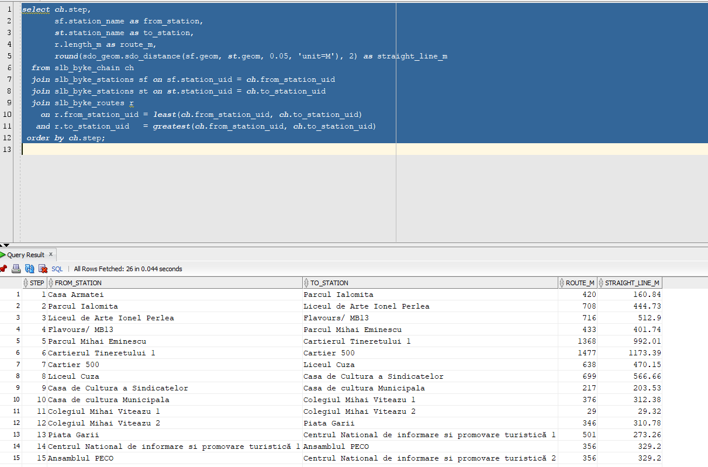
</details>

---

### **Query #10: Chain, Return Leg and Closed Loop Distance**

A conditional `SUM` splits the total into the open chain and the way back:

```sql
select count(*) as nr_legs,
       round(sum(case when ch.step < ( select max(step) from slb_byke_chain )
                      then r.length_m end) / 1000, 3) as chain_km,
       round(sum(case when ch.step = ( select max(step) from slb_byke_chain )
                      then r.length_m end) / 1000, 3) as return_km,
       round(sum(r.length_m) / 1000, 3) as loop_km
  from slb_byke_chain ch
  join slb_byke_routes r
    on r.from_station_uid = least(ch.from_station_uid, ch.to_station_uid)
   and r.to_station_uid   = greatest(ch.from_station_uid, ch.to_station_uid);
```

Result: **chain 21.362 km + return 1.037 km = closed loop 22.399 km**. Compared with the MST's 12.601 km, riding everything as one line costs about 9 km more, because a single ride cannot branch.

- Source code: [slb_byke_chain_total_length.sql](src/ddl_commands/db/query_related/slb_byke_chain_total_length.sql)

<details>
  <summary>Result:</summary>
  <br>
  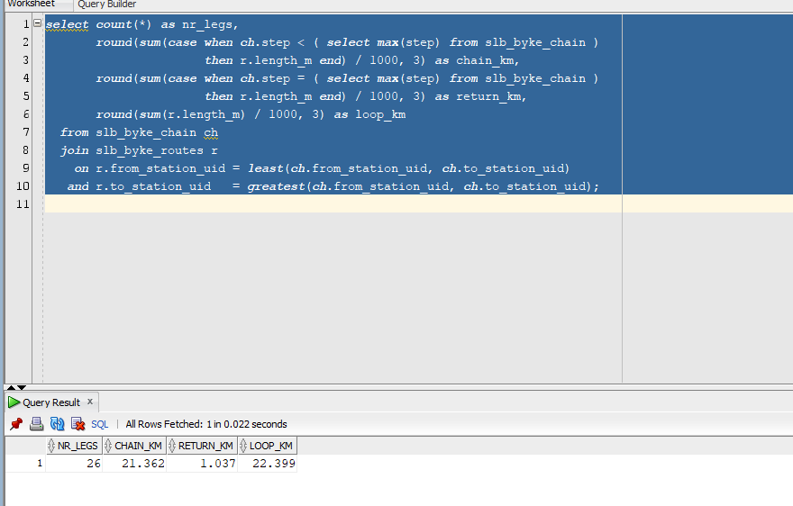
</details>

---

## **A Known Limitation**

The chain can only move along routes that exist in `SLB_BYKE_ROUTES`. The two pairs of stations that share the exact same spot (**Parcul Catedrala 1 / 2** and **Centrul National de informare si promovare turistică 1 / 2**) have no route between them, because their 0 m routes were filtered out during cleaning.

So the greedy algorithm cannot "hop" between twins. Instead it detours, for example **Centrul National 1 → Ansamblul PECO (356 m) → Centrul National 2 (356 m)**, where a 0 m hop and one 356 m leg would have been enough.

The fix is known: add the same-spot pairs to `routes_2way` as **0 m connections**, found with `SDO_GEOM.SDO_DISTANCE(...) < 1`. It is kept as a documented limitation of the current version.

More generally, the nearest-neighbour rule is **greedy**: it is fast and produces a good loop, but it does not guarantee the shortest possible one. Finding that exactly is the travelling salesman problem, which is much harder.

---

## **Export to GPX**

The last step takes the chain out of the database and onto a bike. A Python script reads every leg in riding order, converts each geometry back to GeoJSON with `SDO_UTIL.TO_GEOJSON` (the reverse of the `FROM_GEOJSON` used when loading), and writes one continuous GPX track:

```python
QUERY = """
select ch.step,
       sdo_util.to_geojson(
          case
             when ch.from_station_uid < ch.to_station_uid then r.geom
             else sdo_util.reverse_linestring(r.geom)
          end
       ) as leg_geojson
  from slb_byke_chain ch
  join slb_byke_routes r
    on r.from_station_uid = least(ch.from_station_uid, ch.to_station_uid)
   and r.to_station_uid   = greatest(ch.from_station_uid, ch.to_station_uid)
 order by ch.step
"""

points = []
for step, leg_geojson in rows:
    coordinates = json.loads(leg_geojson)["coordinates"]
    if points:
        coordinates = coordinates[1:]
    points.extend(coordinates)
```

Each leg starts exactly where the previous one ends, so the first point of every leg after the first is dropped to avoid duplicates. GeoJSON stores coordinates as `lon, lat`, while GPX expects `lat="..." lon="..."`, so the order is swapped when writing.

The GPX has **no timestamps**: it is a route to follow, not a recorded activity. It can be opened in [gpx.studio](https://gpx.studio/), Komoot, Garmin Connect or imported as a route on Strava.

- Source code: [byke_chain_gpx_export.py](src/scripts/data_export/byke_chain_gpx_export.py)
- Output: [byke_chain_loop.gpx](src/data_sample/byke_chain_loop.gpx)

---

## **Future Directions**

- **A route generator in PL/SQL.** Turn the current scripts into a package of procedures and functions that build a ride starting from **any** station, combining BRouter routes between stations by criteria such as target distance, stations to include, or preferring segments that overlap the bike lanes.
- **Strava integration.** Upload generated routes to Strava. The Strava API does not create routes, so the realistic path is importing the GPX as a route, and recording real rides on it as activities.
- **Fix the same-spot limitation** with 0 m connections found by `SDO_DISTANCE`.
- **Bike lane analysis.** Measure how much of the MST network is already covered by real bike lanes with `SDO_INTERSECTION`, to show which segments the city still needs to build.
- **No-go streets.** BRouter accepts polygons and polylines to avoid; early tests (526 m normally vs 917 m with one street blocked) showed it works, so riders could exclude streets they consider unsafe.

---

## **How to Run the Pipeline**

1. **Create the staging tables**: run the `*_table_creation.sql` files in [`src/ddl_commands/staging/`](src/ddl_commands/staging/).
2. **Extract and load** each source, from the repository root:
   ```
   python -X utf8 src/scripts/data_extraction/slobozia_map_extraction/slobozia_map_extractor.py
   python -X utf8 src/scripts/data_extraction/slobozia_map_extraction/slobozia_map_loader.py
   python -X utf8 src/scripts/data_extraction/byke_stations_extraction/byke_stations_extractor.py
   python -X utf8 src/scripts/data_extraction/byke_stations_extraction/byke_stations_loader.py
   python -X utf8 src/scripts/data_extraction/byke_routes_extraction/byke_route_ideal_extractor.py
   python -X utf8 src/scripts/data_extraction/byke_routes_extraction/byke_route_ideal_loader.py
   python -X utf8 src/scripts/data_extraction/byke_tracks_extraction/byke_tracks_extractor.py
   python -X utf8 src/scripts/data_extraction/byke_tracks_extraction/byke_tracks_loader.py
   ```
   The `validating_*.sql` files in the staging folder check each load.
3. **Build the city tables**: [`src/ddl_commands/db/slobozia_map/`](src/ddl_commands/db/slobozia_map/). Create the nodes lookup table first, because streets and buildings join to it.
4. **Build the bike tables**: [`src/ddl_commands/db/byke_related/`](src/ddl_commands/db/byke_related/), stations before routes (foreign keys).
5. **Register metadata and create the spatial indexes**: [`src/ddl_commands/db_spatial_related_commands/`](src/ddl_commands/db_spatial_related_commands/).
6. **Create the MST and chain tables**: [`src/ddl_commands/db/query_related/`](src/ddl_commands/db/query_related/).
7. **Run the MST block, then the chain insert**: [`src/queries/route_that_connects_all_stations/`](src/queries/route_that_connects_all_stations/). Both files empty their table first, so they can be run again.
8. **Export the GPX**:
   ```
   python -X utf8 src/scripts/data_export/byke_chain_gpx_export.py
   ```

---

## **Data Sources and Credits**

- **OpenStreetMap**: map data © [OpenStreetMap contributors](https://www.openstreetmap.org/copyright), available under the Open Database License (ODbL). Downloaded through the official [OSM API](https://api.openstreetmap.org/).
- **BRouter**: bicycle routing by [BRouter](https://brouter.de/) (open source, by Arndt Brenschede), running on OpenStreetMap data. Used for the routes between stations and for snapping the bike lanes to the streets.
- **nextbike**: live station data from the public [nextbike live feed](https://maps2.nextbike.net/maps/nextbike-live.json) for Slobozia Bike City (city id 978). Station names and locations belong to nextbike and the city's bike-sharing operator.
- **Google Maps**: the satellite screenshot used as a visual reference, imagery © 2026 Airbus, CNES / Airbus. No Google data is stored or processed in this project.

I do not claim ownership of any of the data above; this repository only processes it for an educational project. If anything here presents an issue, please feel free to contact me.

## **License**

The code in this repository is released under the [MIT License](LICENSE).
